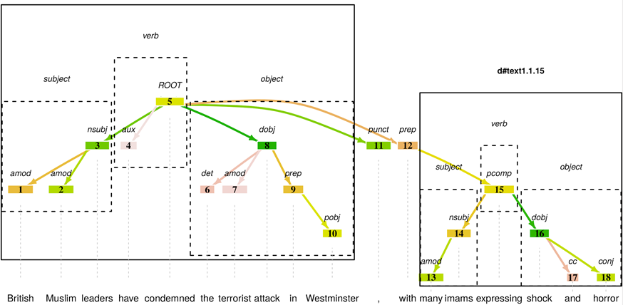
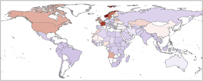

# Data and Code

## Code

- rsyntax – R library to help dealing with syntactic structure
- restecode – An R package for sharing tools and annotations from the ResTeCo project
- RNewsflow – Tools for analyzing content homogeneity and news diffusion using computational text analysis
- textsdc – Statistical Data Cleaning For Text Data
- textplex – Calculate textual complexity using the algorithm by Tolochko & Boomgaarden (2019).
- resdtmf – Responsible Document-Term Matrix Format
- rectr – Reproducible Extraction of Cross-lingual Topics using R

## Data

- Althaus, Scott, Joseph Bajjalieh, Marc Jungblut, Dan Shalmon, Subhankar Ghosh, and Pradnyesh Joshi. 2020. Responsible Terrorism Coverage (ResTeCo) Project New York Times Dataset. Cline Center for Advanced Social Research. May 13. University of Illinois Urbana-Champaign. https://doi.org/10.13012/B2IDB-4638196_V1
- Althaus, Scott, Joseph Bajjalieh, Marc Jungblut, Dan Shalmon, Subhankar Ghosh, and Pradnyesh Joshi. 2020. Responsible Terrorism Coverage (ResTeCo) Project Summary of World Broadcasts (SWB) Dataset. Cline Center for Advanced Social Research. December 16. University of Illinois Urbana-Champaign. https://doi.org/10.13012/B2IDB-2128492_V1
- Althaus, Scott, Joseph Bajjalieh, Marc Jungblut, Dan Shalmon, Subhankar Ghosh, and Pradnyesh Joshi. 2020. Responsible Terrorism Coverage (ResTeCo) Project Foreign Broadcast Information Service (FBIS) Dataset. Cline Center for Advanced Social Research. December 16. University of Illinois Urbana-Champaign. https://doi.org/10.13012/B2IDB-6360821_V1
- Online Appendix for the paper: How combining terrorism, Muslim, and refugee topics drives emotional tone in online news https://doi.org/10.17605/OSF.IO/A4DQP
- Online Appendix for the paper: Four best practices for measuring news sentiment using ‘off-the-shelf’dictionaries: a large-scale p-hacking experiment https://github.com/chainsawriot/ots
