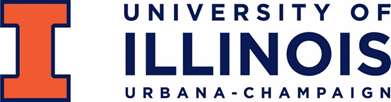
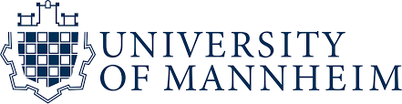
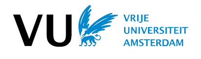

For media inquiries or general questions about the Responsible Terrorism Project, please contact the following ResTeCo team members:

Dr. Scott Althaus  
<a href="https://clinecenter.illinois.edu/people/salthaus">Director of the Cline Center for Advanced Social Research</a> 
<b>Email</b>: salthaus@illinois.edu | <b>Twitter</b>: @scott_althaus

Dr. Chung-hong Chan  
Fellow, Mannheim Center for European Social Research 
<b>Email</b>: chung-hong.chan@mzes.uni-mannheim.de | <b>Twitter</b>: @chainsawriot

Dr. Kasper Welbers 
Associate Professor, Department of Communication Science 
<b>Email</b>: k.welbers@vu.nl | <b>Twitter</b>: @Data_is_fijn

