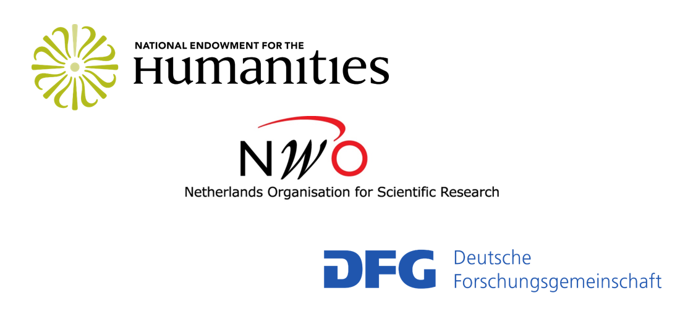

The Responsible Terrorism Coverage project is funded by Round 4 of the Digging into Data Challenge, with support from the US National Endowment for the Humanities (HJ-253500-17), the Netherlands Organisation for Scientific Research (463-17-004), and the German Research Foundation (WE 2888/7-1). The views, findings, conclusions, or recommendations expressed in this website do not necessarily represent those of the National Endowment for the Humanities, the Netherlands Organisation for Scientific Research, or the German Research Foundation.

