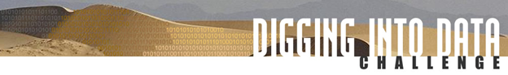

# Publications, Presentations, and Multimedia

## Publications

1. Marc Jungblut, Scott Althaus, Joseph Bajjalieh, Chung-hong Chan, Kasper Welbers, Wouter van Atteveldt, and Hartmut Wessler. Forthcoming. “How shared ties and journalistic cultures shape global variance in news coverage of disruptive media events: The case of the 9/11 terror attacks.” Journal of Communication. https://doi.org/10.1093/joc/jqae004
2. Chung-hong Chan, Hartmut Wessler, Marc Jungblut, Kasper Welbers, Scott Althaus, Joseph Bajjalieh, Wouter van Atteveldt. Forthcoming. “Challenging the global cultural conflict narrative: An automated content analysis on how perpetrator identity shapes worldwide news coverage of Islamist and right-wing terror attacks.” International Journal of Press/Politics. https://doi.org/10.1177/19401612231157655
3. Welbers, K., van Atteveldt, W., & Kleinnijenhuis, J. (2021). Extracting semantic relations using syntax. Computational Communication Research, 3(2), 180-194. (https://computationalcommunication.org/ccr/article/view/51)
4. Wessler, H., Althaus, S., Chan, C.H., Jungblut, M., Welbers, K., & van Atteveldt, W. 2022. Multiperspectival normative assessment: the case of mediated reactions to terrorism. Communication Theory. 32(3): 363-386. https://doi.org/10.1093/ct/qtab007
5. Welbers, K., van Atteveldt, W., Bajjalieh, J., Shalmon, D., Joshi, P., Althaus, S., Chan, C.H., Wessler, H., & Jungblut, M. 2022. Linking Event Archives to News: A Computational Method for Analyzing the Gatekeeping Process. Communication Methods and Measures. 16(1): 59-78. https://doi.org/10.1080/19312458.2021.1953455
6. Althaus, Scott. 2022. “Report on Terrorism Responsibly.” In Fixing American Politics: Civic Priorities for the Media Age, ed. Roderick Hart. Philadelphia: Routledge.
7. Chan, C. H., Bajjalieh, J., Auvil, L., Wessler, H., Althaus, S., Welbers, K., van Atteveldt, W., & Jungblut, M. (2020). Four best practices for measuring news sentiment using ‘off-the-shelf’ dictionaries: a large-scale p-hacking experiment. Computational Communication Research (https://computationalcommunication.org/ccr/article/view/40)
8. Chan, C. H., Zeng, J., Wessler, H., Jungblut, M., Welbers, K., Bajjalieh, J. W., van Atteveldt, W., & Althaus, S. L. (2020). Reproducible extraction of cross-lingual topics (rectr). Communication Methods and Measures, 14(4), 285-305. https://doi.org/10.1080/19312458.2020.1812555
9. Chan, C.H., Wessler, H., Rinke, E.M., Welbers, K., van Atteveldt, W., & Althaus S. (2020). How combining terrorism, Muslim, and refugee topics drives emotional tone in online news: A six-country cross-cultural sentiment analysis. International Journal of Communication https://ijoc.org/index.php/ijoc/article/view/13247
10. Van Atteveldt, W., Althaus, S., & Wessler, H. (2020). The trouble with sharing your privates. Pursuing ethical open science and collaborative research across national jurisdictions using sensitive data. Political Communication https://doi.org/10.1080/10584609.2020.1744780

## Presentations

1. Marc Jungblut, Scott Althaus, Joseph Bajjalieh, Chung-hong Chan, Kasper Welbers, Wouter van Atteveldt, and Hartmut Wessler. 2022. “How shared ties and journalistic cultures shape global variance in news coverage of disruptive media events: The case of the 9/11 terror attacks.” Paper presented at the 72nd Annual International Communication Association Conference, Paris, France, May 26-30.
2. Wessler, H., Althaus, S., Chan, C.H., Jungblut, M., Welbers, K., & van Atteveldt, W. (2021) Responsible terrorism communication: Linking normative theories and empirical insights to inform guidelines for communicators. Accepted for oral presentation at the 71st Annual International Communication Association Conference (Online).
3. Althaus, S., Bajjalieh, J.W., Jungblut, M., Shalmon, D., van Atteveldt, W., & Wessler, H. (2020) Is It Easier to Scare Us or Piss Us Off? The Impact of Terrorist Attacks on News Discourse Across 74 Years of New York Times Reporting. Accepted for oral presentation at the 70th Annual International Communication Association Conference (Online). VIDEO OVERVIEW OF FINDINGS AVAILABLE HERE.
4. Chan, C.H., Wessler, H., van Atteveldt, W., & Althaus, S. (2020) Are Right-Wing Attackers Also Terrorists? An Automated Content Analysis on How Perpetrator Identity Shapes Worldwide English-Language News Coverage of Islamist and Right-Wing Attacks. Accepted for poster presentation at the 70th Annual International Communication Association Conference (Online). [Poster Presentation] VIDEO OVERVIEW OF FINDINGS AVAILABLE HERE.
5. Chan, C.H., Zeng, J., Wessler, H., Jungblut, M., Welbers, K., Bajjalieh, J.W., van Atteveldt, W., & Althaus, S. (2020) Reproducible Extraction of Cross-Lingual Topics Using R. Accepted for oral presentation at the 70th Annual International Communication Association Conference (Online). (Top paper awards, ICA Computational Methods Interest Group). VIDEO OVERVIEW OF FINDINGS AVAILABLE HERE.
6. Welbers, K, van Atteveldt, W., Althaus, S., Wessler, H., Bajjalieh, J.W., Chan, C.H., & Jungblut, M. (2020) Media Portrayal of Terrorist Events: Using Computational Text Analysis to Link News Items to the Global Terrorism Database. Paper presented at the 70th Annual International Communication Association Conference (Online). VIDEO OVERVIEW OF FINDINGS AVAILABLE HERE.
7. Welbers, K., van Atteveldt, W., Chan, C.H., Wessler, H, & Althaus, S. 2020. Suspect by Association: Untangling Semantic Relations Between Muslim Communities and Terrorism in the News. Paper presented at the 70th Annual International Communication Association Conference (Online). VIDEO OVERVIEW OF FINDINGS AVAILABLE HERE.
8. Welbers, K., van Atteveldt, W., Chan, C.H., Wessler, H., & Althaus, S.. (2019) Media portrayal of terrorist events: Using computational text analysis to link news items to the Global Terrorism Database. Paper presented at the 5th International Conference on Computational Social Science, Amsterdam, the Netherlands. [Poster Presentation]
9. Chan, C.H., Bajjalieh, J., Auvil, L., Wessler, H., Althaus, S., Welbers, K., & van Atteveldt, W. (2019) Using ‘off-the-shelf’ sentiment dictionaries without revalidation: a p-hacking experiment. Paper presented at the 5th International Conference on Computational Social Science, Amsterdam, the Netherlands.
10. Althaus, S., Bajjalieh, J., Jungblut, M., Shalmon, D., van Atteveldt, W., & Wessler, H. (2019) “‘Us’ and ‘Them’ across 74 Years of New YorkTimes Terrorism Coverage.” Paper presented at the annual meeting of the American Political Science Association, Boston, MA, USA
11. Welbers, K., van Atteveldt, W., & Kleinnijenhuis, J. (2018) Extracting Semantic Relations Using Syntax: An R Package for Querying and Reshaping Dependency Trees. Paper presented at the 69th Annual International Communication Association Conference, Washing, D.C., USA
12. Althaus, S., Bajjalieh, J., Ghosh, S., Jungblut, M., Shalmon, D., Agosto Rosa, R., van Atteveldt, W., & Wessler, H. (2018) “Framing the Problem of Terrorism across 60 Years of New York Times Coverage: A Preliminary Analysis.” Paper presented at the annual meeting of the American Political Science Association, Boston, MA, August 30-September 2.

## Multimedia

### Introductory video (2018) providing an overview of the ResTeCo project’s goals and focus:

<figure class="wp-block-embed alignwide is-type-video is-provider-youtube wp-block-embed-youtube wp-embed-aspect-16-9 wp-has-aspect-ratio">

<iframe loading="lazy" title="How do journalists responsibly cover terrorism?" width="750" height="422" src="https://www.youtube.com/embed/-0Nin-UGApE?feature=oembed" frameborder="0" allow="accelerometer; autoplay; clipboard-write; encrypted-media; gyroscope; picture-in-picture; web-share" allowfullscreen=""></iframe>

</figure>

### Overview video (2020) reviewing the ResTeCo project’s main findings and contributions:

<figure class="wp-block-embed alignwide is-type-video is-provider-youtube wp-block-embed-youtube wp-embed-aspect-16-9 wp-has-aspect-ratio">

<iframe loading="lazy" title="Responsible Terrorism Coverage Project (ResTeCo) Overview - ICA Conference 2020" width="750" height="422" src="https://www.youtube.com/embed/02Z9BsiZBSA?feature=oembed" frameborder="0" allow="accelerometer; autoplay; clipboard-write; encrypted-media; gyroscope; picture-in-picture; web-share" allowfullscreen=""></iframe>

</figure>

### Overview video (2020) covering the software tools and data released by the Amsterdam ResTeCo team:

<figure class="wp-block-embed-youtube alignwide wp-block-embed is-type-video is-provider-vimeo wp-embed-aspect-16-9 wp-has-aspect-ratio">

https://player.vimeo.com/video/417642922/?autoplay=1

</figure>

### Overview video (2020) covering the software tools and data released by the Mannheim ResTeCo team:

<h4>Overview video (2020) on the <em>New York Times</em> extracted features dataset released by the Illinois ResTeCo team:</h4>

### Overview video (2020) on the New York Times extracted features dataset released by the Illinois ResTeCo team:

<figure class="wp-block-embed-youtube alignwide wp-block-embed is-type-video is-provider-vimeo wp-embed-aspect-4-3 wp-has-aspect-ratio">

https://player.vimeo.com/video/417638114/?autoplay=1

</figure>
