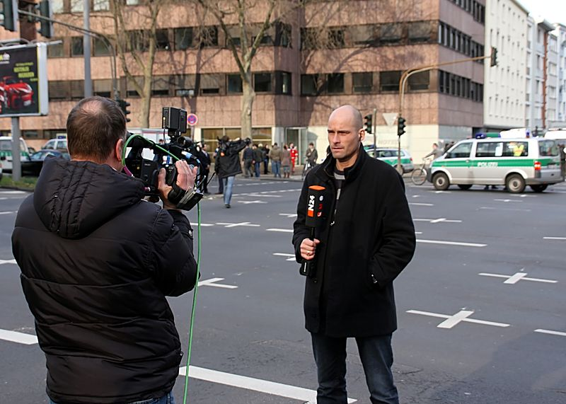
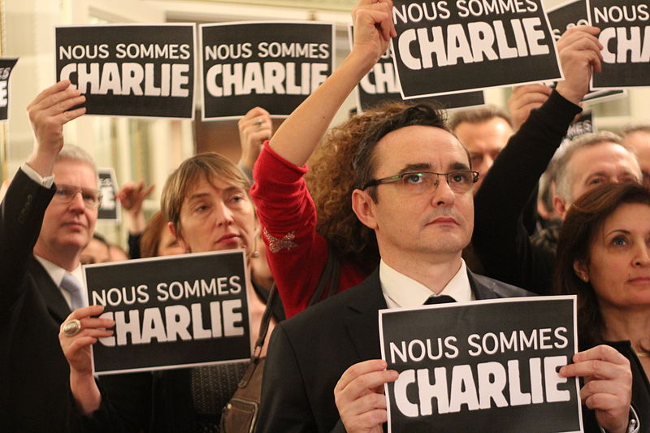

## The Responsible Terrorism Coverage project aims to help journalists provide citizens the information they need without giving terrorists the attention they want.

## Six Recommendations for Journalists and News Organizations

1. **Understand that you stand in the gap between what terrorists do and what terrorists want.** Unsuspecting citizens may be the primary targets of terrorist actions, but unsuspecting journalists are the primary targets of terrorist strategies.
2. **Adopt a clear definition of what terrorism is before the next attack occurs.** The ResTeCo Project’s definition is a useful place to start, but your news organization may want to go farther. For example, what counts as “violence” is a contested topic. It may be important for your news organization to define whether violence against property should be counted as terrorism. Even if you don’t use our definition, your news organization should adopt a consistent way of identifying terrorism when it happens so that you can help reduce the communication echo that terrorists hope to generate from news coverage of their attacks.
3. **Consistently label every act of violence that meets the definition as terrorism, but avoid using the term to describe any other act of violence.** Consistent use of delegitimizing language hinders terrorists in getting what they want. This is why defining terrorism is important: a clear definition empowers news reporters to know when to consistently employ delegitimating labels like “terrorist” to describe the perpetrators of an attack. Delegitimizing language should be used in news reporting whenever the definitional elements are all represented in a particular attack or situation.
4. **Emphasize dispassionate statements of fact about terrorist events that convey what happened, where it happened, when it happened, who committed the act, and who was victimized by the act.** Reporting that emphasizes “who, what, where, and when” questions about terrorist attacks provide the best balance between giving citizens the information they need without giving terrorists the coverage they want.
5. **Avoid story topics that explore how the act was committed or why the act was committed.** Reporting that emphasizes “how and why” questions about terrorist attacks carries significant risks of advancing terrorists’ strategic communication goals. This is because it is difficult to address “how they did it” questions without helping terrorist groups appear to be credible threats to public order, and it is difficult to address “why they did it” questions without drawing attention to terrorist grievances and demands.
6. **Avoid story topics and styles of reporting that are likely to stir up feelings of outrage or fear in news audiences.** Reporting that generates strong emotions of anger or anxiety is likely to play into the hands of terrorists’ strategic communication goals.

## Eight Recommendations for Social Media Users and Platforms

1. **Understand that your choices about what information to seek, say, and pass along about terrorist events hold the power to translate terrorist actions into political gains.** Your social media choices can also hinder terrorists in producing the political leverage they intend for their violence to generate.
2. **Signaling you’re safe in the immediate aftermath of nearby a terrorist attack helps reduce levels of fear or anxiety in a targeted population.** Letting others know that you’re safe not only puts your friends and family at ease but also reduces the chances that they will in turn produce social media messaging with potential to stoke fear or anger in others.
3. **Before you post about a terrorist attack, confirm that any factual claim you intend to share has been verified by at least two credible news sources.** Terrorists thrive in a climate of fear and outsized concern about the potential threat they represent. Don’t help them with their messaging goals by passing along hearsay information about terrorist tactics, goals, or capabilities.
4. **Offering messages of sympathy for victims of terrorist violence and support for first responders strengthens a targeted population without giving terrorists anything they want.** This is one of the best ways of countering terrorist’s messaging strategies because it both denies terrorists the communication echo they hope to generate from their attacks and increases the resilience of the targeted population.
5. **Demonstrating solidarity with people who happen to be of the same religion, ethnic group, or part of the world as terrorist perpetrators undercuts terrorists’ efforts to stoke fear, suspicion, and overreaction by governmental authorities.** When terrorists pursue provocation strategies they are hoping to encourage authorities to overreact in the aftermath of violence. Demonstrating solidarity with suspect communities improves the resilience of the targeted population and increases the ability of governing leaders to respond appropriately to terrorist threats.
6. **Avoid naming particular terrorists, terrorist groups, or terrorist acts.** Terrorists thrive on attention and notoriety. Don’t let them have it. If you have to say something, post about terrorists or terrorism in general without drawing attention to particular individuals, groups, or violent events.
7. **Never share terrorist manifestos, videos, or photos from a terrorist attack.** Reporting that generates strong emotions of anger or anxiety is likely to play into the hands of terrorists’ strategic communication goals.
8. **Avoid posting messages that express fear, outrage, or a desire for retribution in the aftermath of terrorist attacks.** Terrorist groups can win by either scaring us or by stoking our anger. Since either reaction advances their causes, it is important to deny terrorists the one thing they want more than any other: to generate an extreme emotional response in a targeted population.
