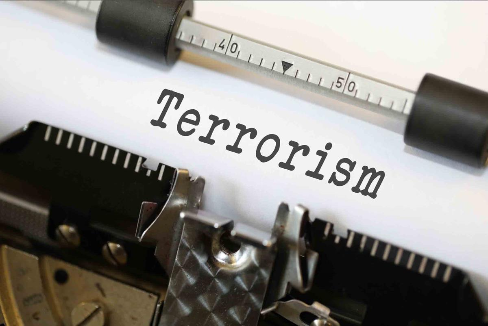

The Responsible Terrorism Coverage (ResTeCo) offers analyses and recommendations are closely tied to a specific definition of terrorism. Journalists and policy makers should understand what exactly we mean when we talk about “terrorism” as a distinctive form of political violence.

The ResTeCo project defines terrorism as a tactic chosen by non-state actors that uses violence to generate publicity in order to achieve political goals by exploiting fear and shaping the perceptions of multiple audiences. This is aligned with widely-used academic definitions of terrorism (e.g., Hoffman 2006) but emphasizes the strategic communication dimensions of terrorist acts.

## Terrorism Is A Tactical Choice

Terrorism is a behavior, not an identity. Groups engage in terrorism because they want something, and they see terrorism as a potentially useful means of getting it. Organizations that perpetrate terrorist acts often have a diverse repertoire of political behavior that includes nonviolent political action and other forms of violence besides terrorism.

Groups engaging in terrorism generally believe it to be a better option for acheiving their political goals than other tactics available to them. If they believed that terrorism was less effective than nonviolent tactics at bringing about political change, the same groups would have probably choosen nonviolent tactics.

## Made by Non-State Actors

Terrorism is a tactic used by groups that operate outside the structures of governmental institutions. ResTeCo, like most other data-driven projects on terrorism, defines terrorism as a form of violence perpetrated by non-state actors: groups that exist outside of formal governmental institutions. Non-state actors are sometimes funded or influenced by states, and may have a political wing that works to influence formal institutions of government. But to meet our definition, the perpetrator of a terrorist act must be outside the governing structure of a recognized nation-state.

State-perpetrated violence that is consistent with other parts of our definition may take the form of atrocities or crimes against humanity, but state-perpetrated violence is not “terrorism” as we define it here.

## For Pursuing Political Goals

Terrorism is distinct from other forms of illegal violence because it uses violence as a means to bring about political change. These goals may range from inspiring global economic transformation to coercing a government into dramatically changing its domestic or foreign policies.

In contrast, criminal violence is not considered terrorism unless it is clearly connected to a political motivation, even in cases when criminal violence produces heinous acts of mass murder. It follows that failure to achieve political goals using terrorist attacks will motivate actors to consider other tactics.

## Using Violence to Generate Publicity

Terrorists use violence to gain public notice, and the tactics generally associated with terrorism—suicide bombings, hostage-taking, and targeting of civilians—are chosen precisely because they shock the conscience and draw attention. This violence is not an end in itself, but rather a message that is perpetrated.

Terrorists use violence as a communication strategy to influence audiences beyond their immediate target. Whether conveyed through word of mouth or broadcast through digital media, reports of terrorist violence carry messages beyond the immediate vicinity of the event that (terrorists hope) will help them advance their political goals.

Larger violent non-state actors often engage in insurgency, using guerrilla tactics like hit-and-run attacks on military targets. What distinguishes terrorist acts from guerrilla warfare is the calibration of violence in order to send a wider message. Terrorism does not work if it goes unnoticed.

## That Exploits Fear and Shapes the Perceptions of Multiple Audiences

As a tactic used by non-state actors to achieve political goals, terrorism can only succeed when it generates publicity that shapes perceptions about the group and its agenda. Terrorist attacks are often carefully planned and deliberately calibrated to exploit fear and produce other kinds of far-reaching psychological effects. Terrorists hope that these effects will provide the leverage they need to coerce their targets and achieve their political goals.

Any given attack may have multiple intended audiences. Terrorist messaging targets a population that is attacked as well as that population’s political leaders. But terrorists also use attack-related publicity to strategically communicate with sympathizers and third parties. Perpetrators of terrorist acts may intend for each of these audiences to receive very different messages about the same event. And precisely because terrorist groups have multiple audiences in mind when they commit acts of violence, it can be difficult to pin down the communication goals of any particular group or any particular attack. This also makes it difficult to identify how effective a terrorist group might have been in producing its intended effects.

Among the multiple audiences that terrorists attempt to influence, shaping perceptions held by the targeted population and its leaders offers perhaps the biggest potential payoff. Inciting fear is essential to the definition of terrorism, but most perpetrators also have other aims. These generally include convincing some audience their political ends are just, and that the violent means they choose are thus legitimate. This is why most perpetrators of terrorism vehemently reject the label “terrorist.”

But whether terrorists aim to instill fear, inspire new recruits, or convince government experts they are highly capable, our definition of terrorism emphasizes that violent non-state actors can’t achieve any of their aims without the help of third parties like unwitting news organizations and social media users to distribute their desired messages in their intended ways. The Responsible Terrorism Coverage project aims to help journalists provide citizens the information they need without giving terrorists the attention they want.
