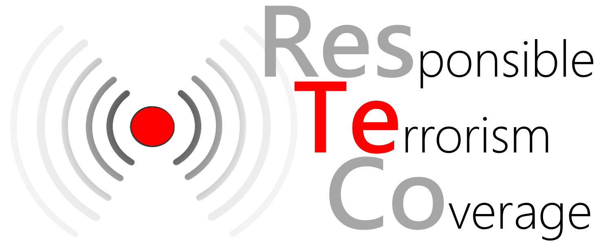

# What Terrorists Want from News Coverage

Research in peace science often suggests a vague and diffuse set of implied expectations about terrorist communication goals. The ResTeCo Project team synthesized these expectations into theoretically distinctive and empirically operationalizable measures that help us understand when terrorists are getting the kinds of attention they hope to create for themselves.

## Three Primary Strategic Communication Goals of Groups that Use Terrorist Tactics

1. Increase the group’s visibility by drawing attention to terrorist demands and capabilities. Visibility is a necessary condition for achieving any terrorist group’s political goals.

2. Increase the group’s legitimacy by avoiding derogatory labels like “terrorist” and by elevating the group’s grievances into public view.

3. Increase the group’s prestige among its rivals and potential funders by being seen as a credible threat to public order that is being taken seriously by political institutions in the target population.

## Two Additional Goals for Acheiving Political Leverage

4. “Scare Us” (when using attrition strategies) by cuing fear, powerlessness of target population, disunity within the target population.

5. “Piss Us Off” (when using provocation strategies) by stimulating outrage, increasingly moralized discourse, solidarity within the target population.

